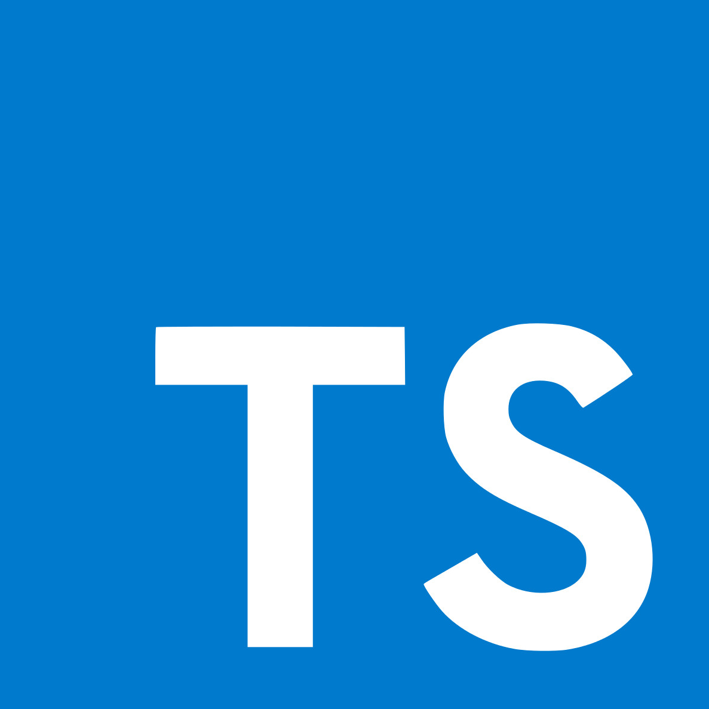

# ts-exercise

<!-- PROJECT LOGO -->
<br />
<div align="center">
  <a href="https://www.typescriptlang.org/download">
    
  </a>

  <h3 align="center">Typescript Exercise</h3>

  <p align="center">
   This is a README file for a TypeScript exercise.
    <br />
    <a href="https://github.com/othneildrew/Best-README-Template"><strong>Explore the docs »</strong></a>
    <br />
    <br />
    <a href="https://www.w3resource.com/typescript-exercises/typescript_object-oriented_exercises.php">Question</a>

  </p>
</div>

<!-- GETTING STARTED -->

## Getting Started

This guide will walk you through setting up your environment to run TypeScript in Visual Studio Code and introduce you to some basic exercises to practice your skills.

### Prerequisites:

- Node.js v16 or Later
- Typescript 5.3 or Later
- VS code installed

### Installation

1. Clone the repo
   ```sh
   git clone git@github.com:KruyTharin/ts-exercise.git
   ```
2. Install NPM packages
   ```sh
   npm install
   ```
3. Compile TypeScript code:

   This will compile all _.ts files in the project to _.js files.

   ```sh
   tsc
   ```

4. Run and Debug

   

<!-- USAGE EXAMPLES -->

## Usage

_For more examples, please refer to the [Documentation](https://www.typescriptlang.org/download)_

> typescript.ts


> index.ts


> output


